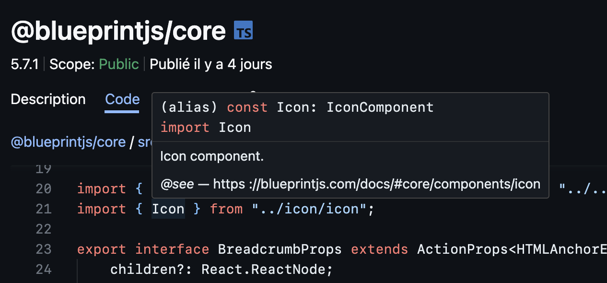

# npm-browser


## Features

|                    Intellisense                     |
| :-------------------------------------------------: |
|  |

## Build

```sh
yarn build

# Build to a single JavaScript file containing all assets
./scripts/build-bundle.ts
```
